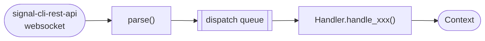
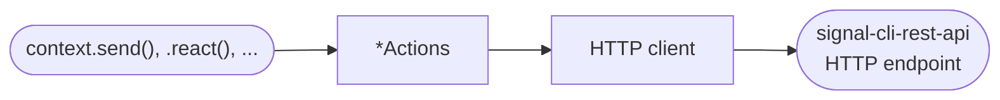
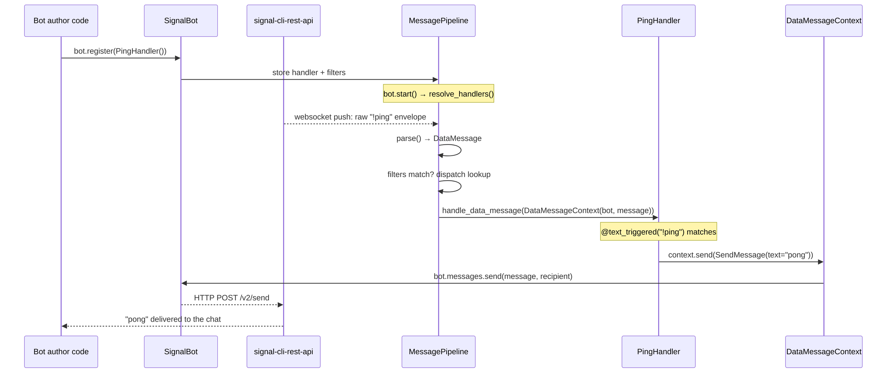

Signalbot moves messages in two directions: **incoming** messages arrive over a websocket and are
routed to your code, **outgoing** messages are sent by your code through an HTTP API. This page
shows how the pieces fit together.

## Architecture

### Incoming



### Outgoing



- **Incoming**: The internal pipeline reads the websocket, an internal `parse()` turns the raw JSON into a
  [`ReceivedMessage`][signalbot.messages.ReceivedMessage], dispatches it to the matching
  `Handler` and [`Context`][signalbot.context.Context] subclass before
  your `handle_xxx` method runs.
- **Outgoing**: calling a method on `context` (or directly on `bot.messages` / `bot.reactions` /
  ...) resolves the recipient, builds a request object, and sends it through an internal HTTP client to `signal-cli-rest-api`.

## Registration

Before any of this runs, handlers need to be registered with the bot — typically once at startup,
e.g. `bot.register(PingHandler())`. The `bot.register()` just stores the handler and its filters;
nothing is invoked yet. From then on, every incoming message is checked against each registered
handler's filters and invoked with a fresh `Context`.
Registration is the opening step of the walk-through below (steps 1-2).

## Following one message end to end

Take a bot with a single handler:

```python
class PingHandler(DataMessageHandler):
    @text_triggered("!ping")
    async def handle_data_message(self, context: DataMessageContext) -> None:
        await context.send(SendMessage(text="pong"))
```



Every incoming message type has its own `Handler`/`Context` pair and dispatch entry (see the table
in [Extending signalbot](06_extending.md#new-incoming-message)) — this walk-through uses
`DataMessage` because it's the most common case, but reactions, typing indicators, remote deletes,
and group updates all follow the same shape.
