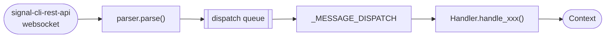
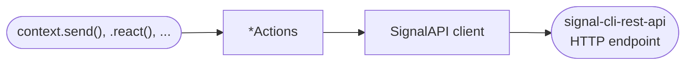
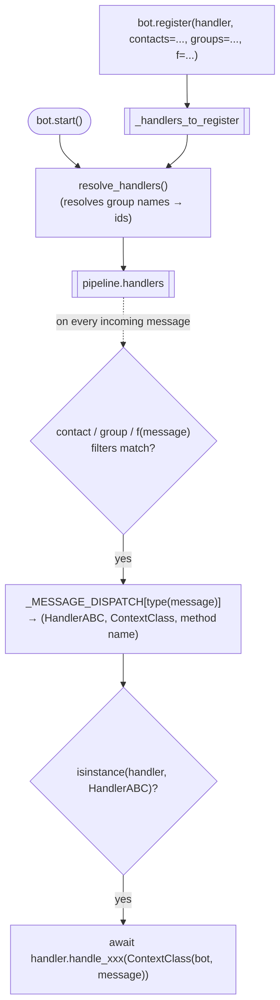
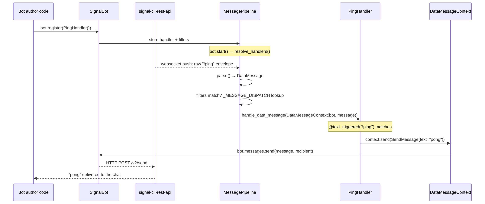

Signalbot moves messages in two directions: **incoming** messages arrive over a websocket and are
routed to your code, **outgoing** messages are sent by your code through an HTTP API. This page
shows how the pieces fit together — read [Extending signalbot](06_extending.md) once you're ready
to add a new message type or action yourself.

## Architecture

### Incoming



### Outgoing



- **Incoming**: `MessagePipeline._produce` reads the websocket, `parse()` turns the raw JSON into a
  typed [`ReceivedMessage`][signalbot.messages.ReceivedMessage], and `_MESSAGE_DISPATCH` decides
  which [`Handler`][signalbot.handlers] ABC and [`Context`][signalbot.context.Context] subclass
  apply before your `handle_xxx` method runs.
- **Outgoing**: calling a method on `context` (or directly on `bot.messages` / `bot.reactions` /
  ...) resolves the recipient, builds a wire request, and sends it through
  [`SignalAPI`][signalbot.client.SignalAPI] to `signal-cli-rest-api`.

## Registration

Before any of this runs, handlers need to be registered with the bot — typically once at startup,
e.g. `bot.register(PingHandler())`. There are two ways to look at what that does; see which one
clicks and drop the other.

### Option A — registration as its own diagram



`bot.register()` just stores the handler and its filters; nothing is invoked yet. At startup,
`resolve_handlers()` turns group names into group ids. From then on, every incoming message is
checked against each registered handler's filters, matched against `_MESSAGE_DISPATCH` by message
type, and — only if the handler is actually an instance of the expected `Handler` ABC (e.g. a
`ReactionHandler` is skipped for a `DataMessage`) — invoked with a fresh `Context`.

### Option B — registration folded into the message lifecycle

Instead of a separate diagram, registration can be shown as the opening step of one concrete
message's journey — see steps 1-2 below.

## Following one message end to end

Take a bot with a single handler:

```python
class PingHandler(DataMessageHandler):
    @text_triggered("!ping")
    async def handle_data_message(self, context: DataMessageContext) -> None:
        await context.send(SendMessage(text="pong"))
```



Every incoming message type has its own `Handler`/`Context` pair and dispatch entry (see the table
in [Extending signalbot](06_extending.md#new-incoming-message)) — this walk-through uses
`DataMessage` because it's the most common case, but reactions, typing indicators, remote deletes,
and group updates all follow the same shape.
